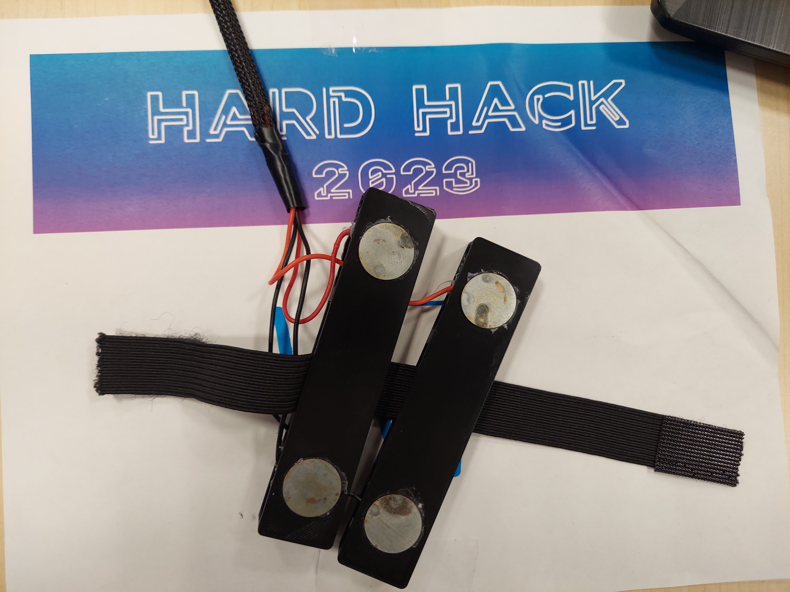
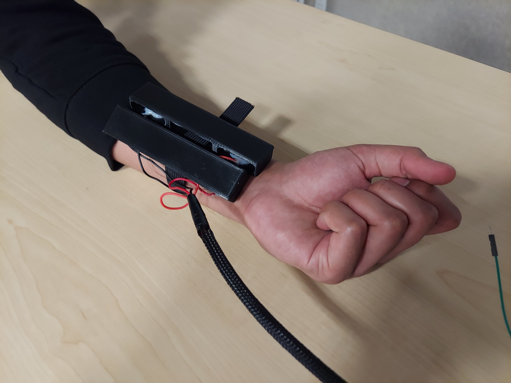
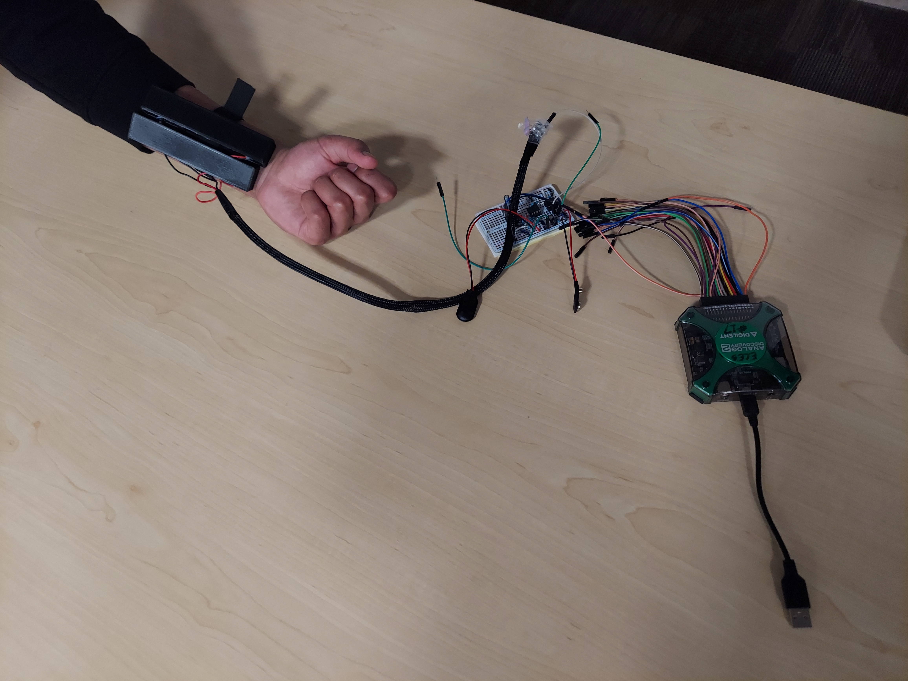
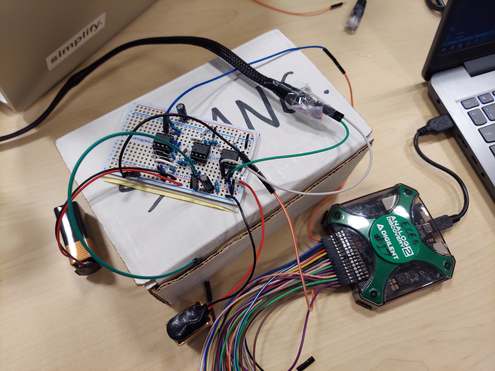
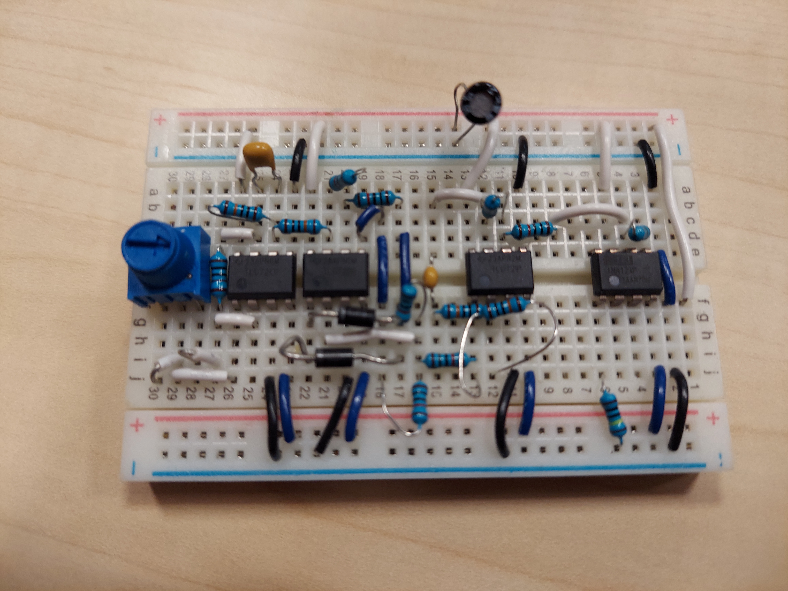
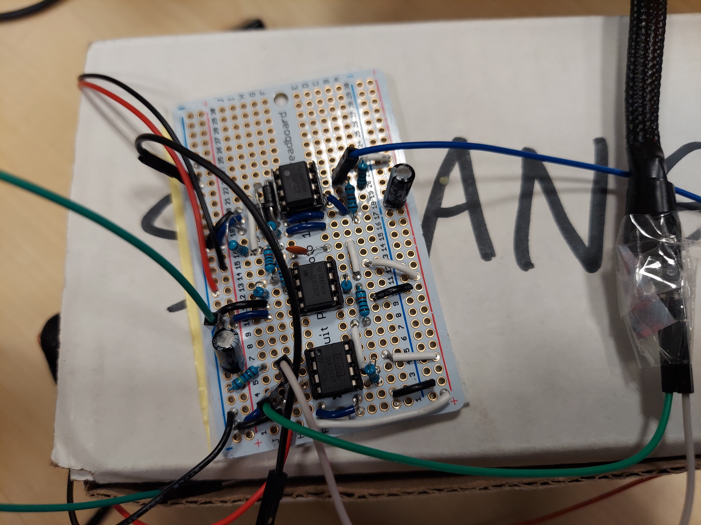
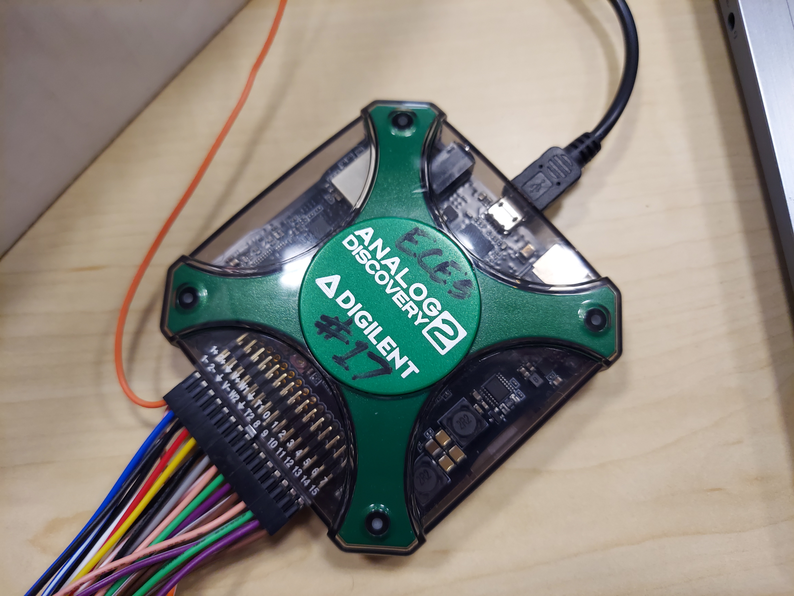

# Audio EMG - H.A.R.D. Hack 2023

Winner of the Triton NeuroTech challenge at H.A.R.D. Hack 2023, San Diego’s largest
hardware focused hackathon!

Members of our team:
- Pierre Beurtheret
- Rana Singh
- Shaung Xiang

## Pitch

Imagine trying to walk without being able to feel your legs.
This is a daily struggle for those with physical disabilities or injuries.
Our project’s goal is to provide a cost-effective tool to assist recovery.

An electromyograph (EMG), is a device which measures the electrical activity of muscles during contraction and relaxation.
Our amplification circuit boosts the faint signals from the EMG,
which is then acquired by an Analog Discovery 2.
Our Python program then relays the signal back to the user as real-time audio,
providing immediate feedback, leading to better outcomes and faster recovery.

## Photos

### Electromyograph (EMG)

### Closeup of EMG strapped to arm

### EMG strapped to arm

### Full setup, with EMG strapped to arm, amplifier, and Analog Discovery 2

### Setup with amplifier and Analog Discovery 2

### Amplifier circuit on a breadboard

### Amplifier circuit on a solderable breadboard

### Analog Discovery 2

